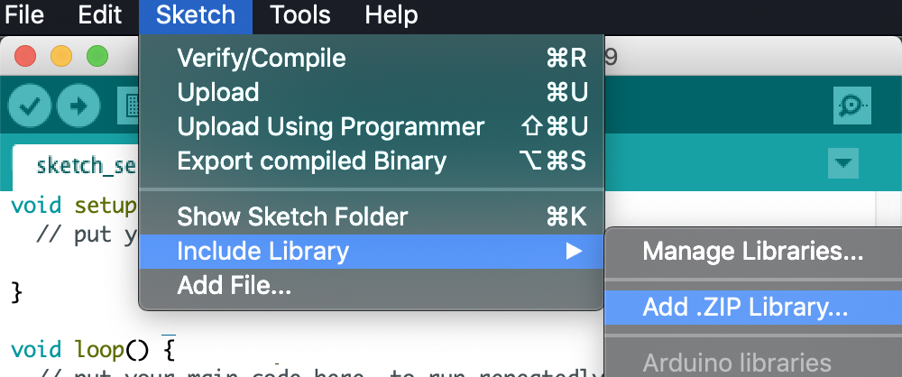
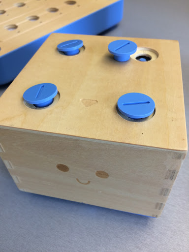
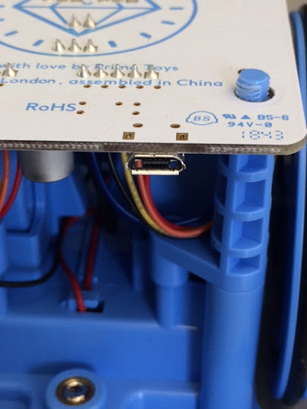
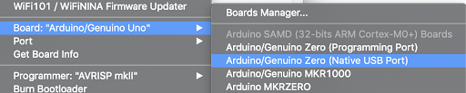
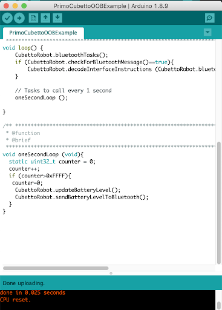

This repo contains source code for the Cubetto robot.

This is an unofficial repository and the contents were retrieved from: https://drive.google.com/file/d/0B0CGyWe9uilVc0Nycms2QnFJOTg/view

#How to Change Cubetto's Sound Output 

##Prerequisite
###Hardware: 
Cubetto : [Primotoys](https://www.primotoys.com)
Micro-B USB cable

###Software: 
Arduino IDE : [Arduino](https://www.arduino.cc/en/Main/Software)
Modified Cubetto source code: https://github.com/chosww/cubetto/releases/download/audio-feedback-0.1/Cubetto.zip

##How to update Cubetto’s source code

1. Unzip the downloaded source code from the prerequisite. 
2. After Installing Arduino IDE, open the IDE.
3. On Arduino IDE, update the two ZIP files AccelStepper.zip and CubettoLibrary.zip from the source code by pressing Sketch at the menu then press Include Library, and click Add .ZIP Library.  

4. Check if the upload was successful by checking at the status bar at the bottom of IDE.  

5. Open Cubetto’s hardware by unscrewing 4 bolts at the top.  

6. Connect the Arduino board of Cubetto to your computer by using a micro USB cable.  

7. Go back to Arduino IDE and press tools then click Board then Arduino/Genuino Zero, and if you have to specify a port, select Arduino/Genuino Zero (Native USB Port).  

8. Again press tools then click Port, and select port that Arduino board is connected.
9. Open the Arduino sketch that was included in the source code by double clicking on the file in PrimoCubettoOOBExample folder or by pressing file, open and move to the directory where the downloaded sketch is and click open. 
10. Press upload button from the sketch (arrow key at the top side of the IDE).  

11. Once it’s uploaded successfully, you will see Done uploading message at the status bar.  
