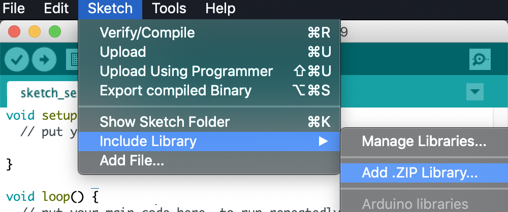
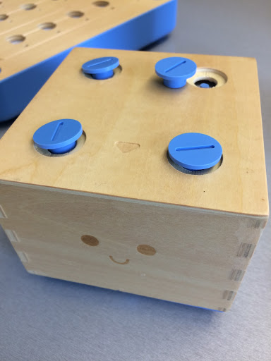

# Cubetto

This repo contains source code for the Cubetto robot.

This is an unofficial repository and the contents were retrieved from: https://drive.google.com/file/d/0B0CGyWe9uilVc0Nycms2QnFJOTg/view

## Customized Movement Tones

This branch contains modifications that customize the tones played when moving Forward, Left, and Right.

## How to Update Cubetto’s Firmware

### Prerequisites

Hardware:

- [Cubetto](https://www.primotoys.com)
- Micro-B USB cable

Software:

- [Arduino IDE](https://www.arduino.cc/en/Main/Software)

### Steps

#### 1. Download the modified Cubetto source code

Download and unzip the modified Cubetto source code:

https://github.com/chosww/cubetto/releases/download/audio-feedback-0.1/Cubetto.zip

#### 2. Open the Arduino IDE

Open the Arduino IDE.

#### 3. Add the Cubetto library files

In Arduino IDE, add the `AccelStepper.zip` and `CubettoLibrary.zip` libraries from the downloaded source code: For each of the two libraries, open the Sketch menu, then the "Include Library" sub-menu, click "Add .ZIP Library...", and select the library file from the downloaded source code.

A message will be displayed in the status bar at the bottom of IDE if the library is uploaded successfully.

#### 4. Remove the Cubetto robot cover

Remove the cover from the Cubetto robot by unscrewing 4 bolts on the top.

#### 5. Connect the Cubetto board to your computer

Connect the Arduino board of Cubetto to your computer using a micro USB cable.

#### 6. Select "Arduino/Genuino Zero" in the Arduino IDE

We need to tell the Arduino IDE that the Cubetto board is compatible with the Arduino Zero board: In Arduino IDE, open the Tools menu, then the Board sub-menu, and select "Arduino/Genuino Zero". If you have to specify a port, select Arduino/Genuino Zero (Native USB Port).

If "Arduino/Genuino Zero" is not available as an option, it can be installed using the "Boards Manager", available on the Board sub-menu.

#### 7. Select the port that the Cubetto is attached to

In the Arduino IDE, open the Tools menu, click Port, and select port that Arduino board is connected.

#### 8. Open modified the source code project

In the Arduino IDE, open the File menu, and click "Open...". Navigate to the downloaded and unzipped source code (from Step 1 above), and open the `PrimoCubettoOOBExample.ino` file in the PrimoCubettoOOBExample directory.

#### 9. Upload the new firmware to Cubetto

The firmware may be uploaded to Cubetto by clicking on the "Upload" button (a rightwards pointing arrow in the IDE toolbar), or by selecting "Upload" from the "Sketch" menu.

A message will be displayed in the status bar at the bottom of IDE if the firmware is uploaded successfully.

